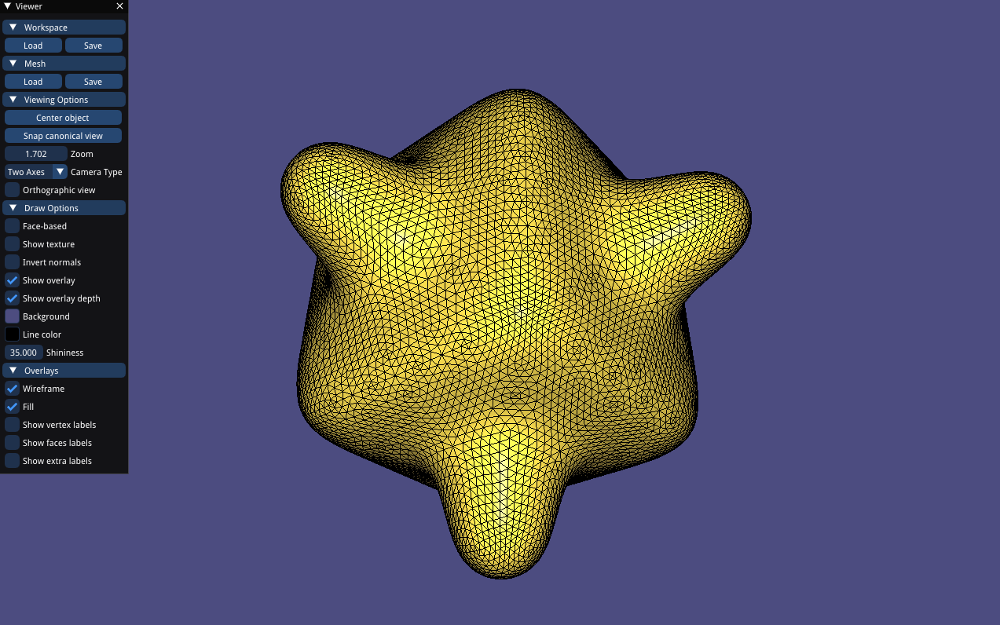
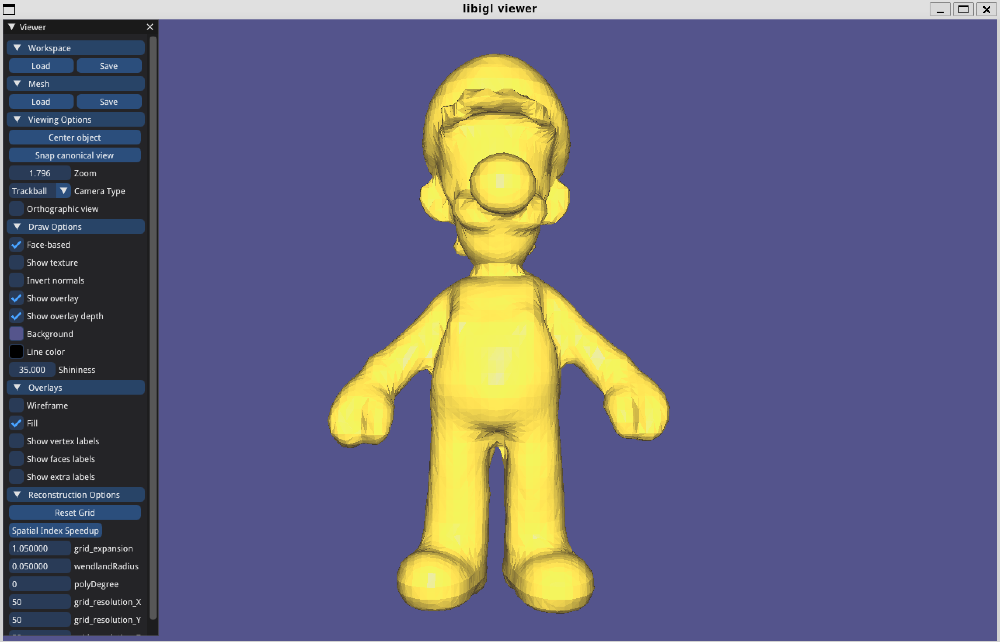
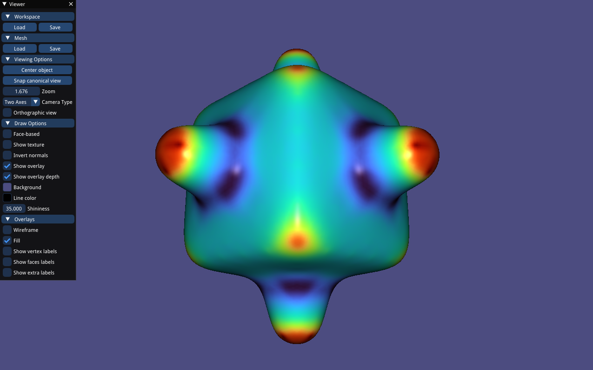

# Shape Modeling and Geometry Processing - Course Assignments 2024

Shape Modelling and Geometry Processing course at ETH, feel free to refer the code and report in each section for more details.

## Assigment1 Simple Shading & Remeshing

* Neighborhood computation (starter)
* Simple shading
* Connected components coloring
* $\sqrt{3}$ subdivision

## Assigment2  Implicit Surface Reconstruction

* MLS interpolation
* Marching cubes surface extraction
* Point cloud normal estimation via PCA

## Assigment3 Differential Properties & Smoothing

* Normal estimation

* Discrete curvature

* Laplacian smoothing

* Bilateral smoothing

  

## Assigment4 Mesh Parameterization

* Uniform Laplacian

* Cotangent Laplacian 

* Least Squares Conformal Maps(LSCM) 

* As-Rigid-As-Possible(ARAP) 

  

## Assigment5 Shape Deformation

* Multiresolution mesh editing

* Deformation transfer

  

## Assigment6 Animation

* Skeleton animation

* Harmonic skinning weights computation
* Linear Blend Skinning(LBS)
* Dual Quaternion Skinning(DQS)
* Per-face Blend Skinning with Poisson Stitching
* Context aware deformation (per-vertex, per-face)

