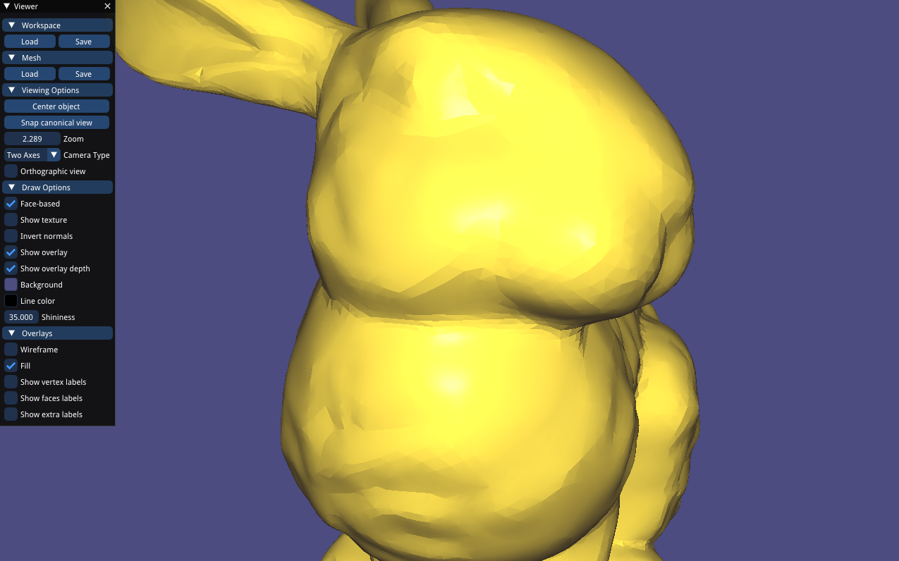
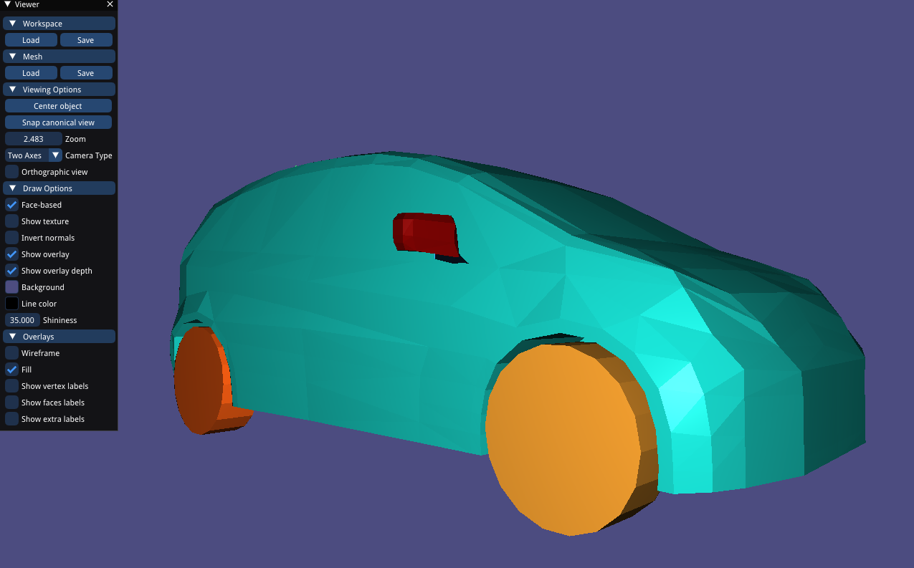
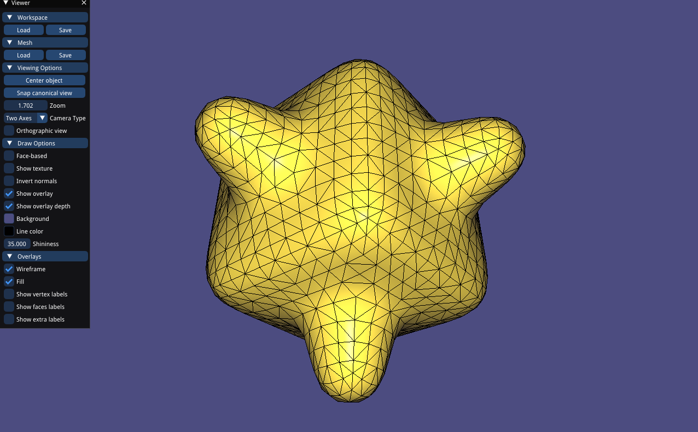
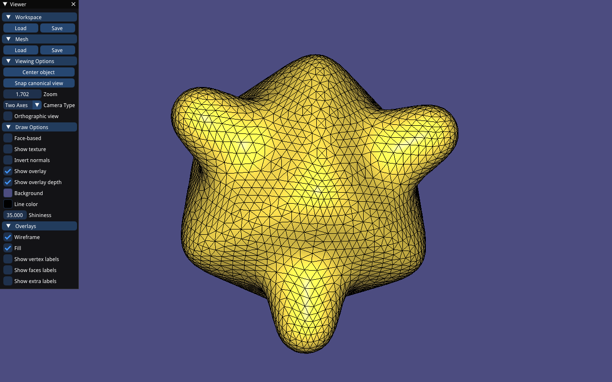

# Assignment 1: Simple Shading & Remeshing
## Shading
### Per-face shading

### Per-vertex shading

### Per-corner shading

for those angle of adjacent face normal less than given threshold, essentially per-vertex shading; otherwise, essentially per-face shading

## Component Coloring

## Remeshing

org:

remeshing once:

remeshing twice:

