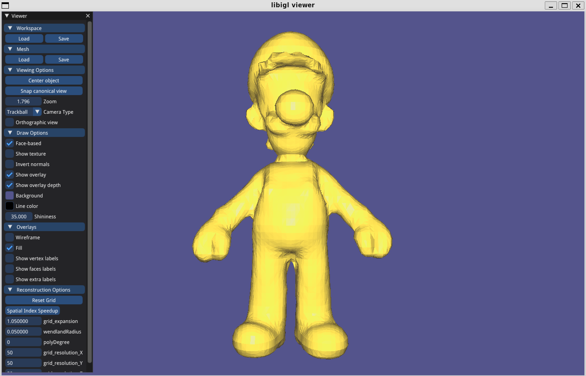

# Assignment 2
Name: 'Sihan Chen'

Legi-Nr: '23-943-079'

## Required results
Edit this 'README.md' file to report all your results. You only need to update the tables in the reports section by adding screenshots and reporting results.

### Tasks

1) Theory question (1): Save your notes to assignment2/results and link to them from within the report.

2) Theory question (2): Save your notes to assignment2/results and link to them from within the report.

3) Compare your MLS reconstruction results to the surfaces obtained with RIMLS and Screened Poisson Reconstruction, and inspect the differences. Report your findings.

## Reports

### 1 - Theory Question 1

**Prove that the normal of a surface defined by an implicit function is proportional to its gradient.**

Please show your answer in screenshot/photos (or link to a PDF). Make sure your answer is readable. You can add more pages by modifying the table.

|                  page1                  |
| :-------------------------------------: |
|  |

### 2 - Theory Question 2

**Compute the closed-form gradient of the MLS approximation.**

Please show your answer in screenshot/photos (or link to a PDF). Make sure your answer is readable. You can add more pages by modifying the table.

|                  page1                  |
| :-------------------------------------: |
|  |

### 3 - MLS v.s. Screened Poisson Reconstruction v.s. RIMLS

**No implementation required, you can use [Meshlab](https://www.meshlab.net) to perform the comparisons.**

| model names  | MLS          | Possion             | RIMLS               |
| :---------:  | :---------:  | :-----------------: | :-----------------: |
| cat          ||  | |
| luigi        ||  | |
| comments        | 1.The bottom of cat has some spurious sheets, like RIMLS, but worse  2.Can't reconstruct sharp features well, e.g., the nose of Luigi | 1. No spurious sheets far from surface, e.g., bottom of cat)  2.Robust to outliers | 1.Robust to outliers  2.Better reconstruction of sharp features, e.g., the hat edge of Luigi |

