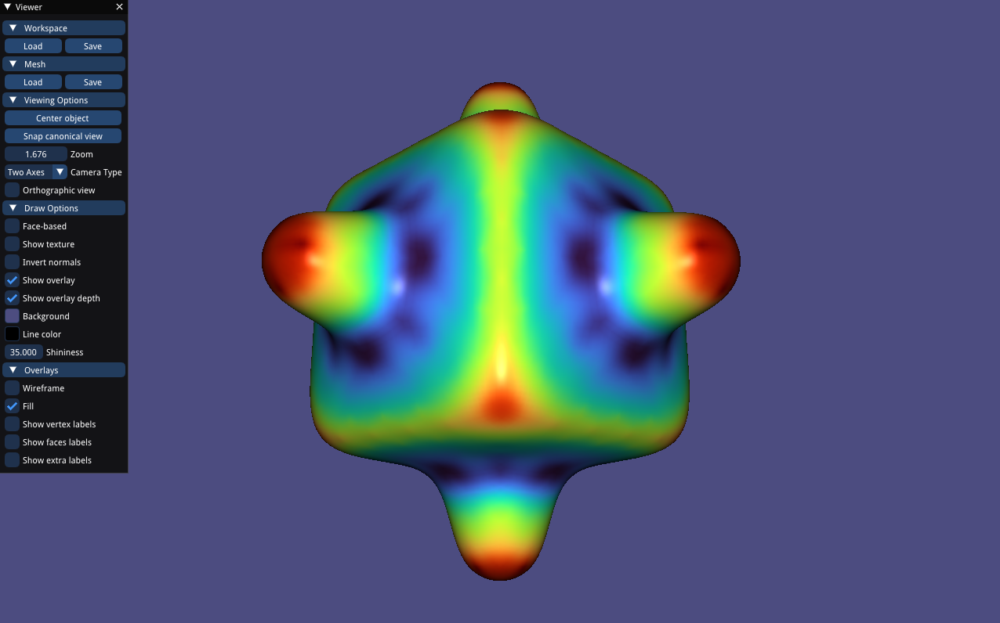
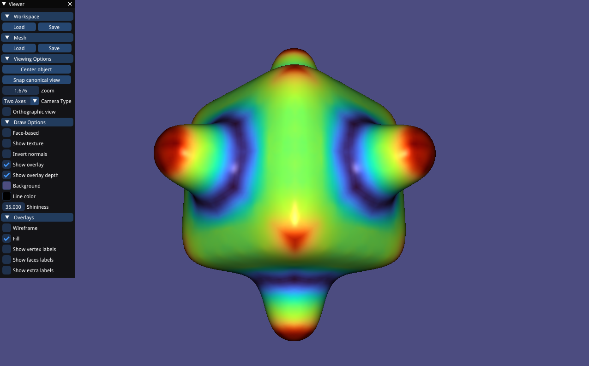
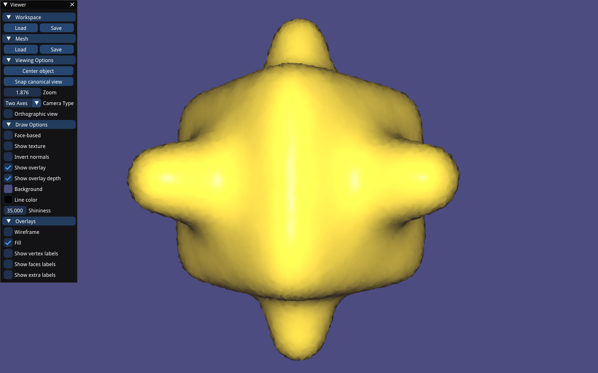
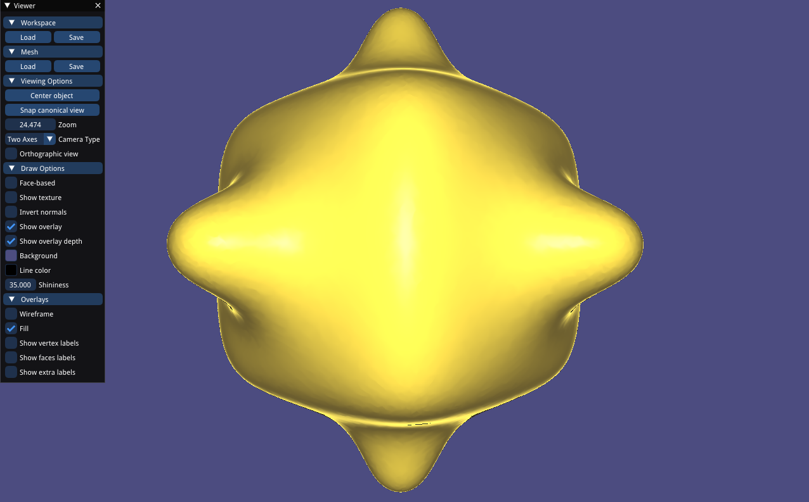
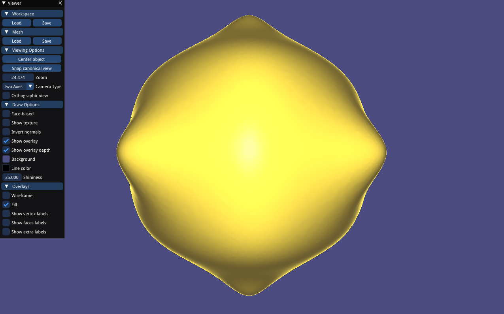
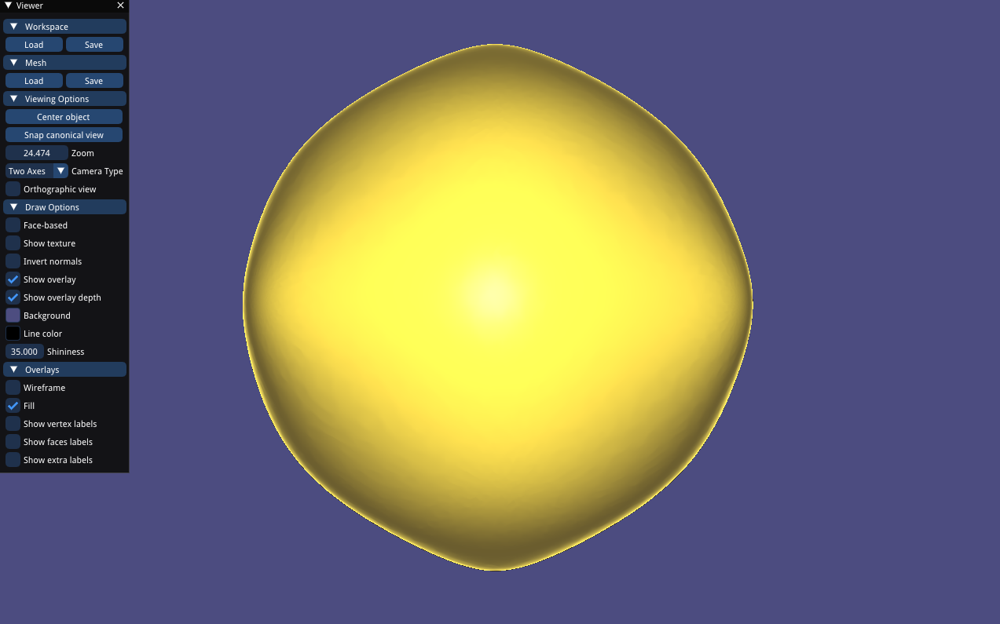

# Assignment 3 Differential Properties & Smoothing

zero point's curvature is 0 for kappa2  kappa3 -> a c
same sign for curvature at both sides for (a) -> kappa3
a:kappa3
c:kappa2

b:kappa4 (clock-wise, counter-clock wise, clock-wise)
d:kappa1 (always same sign, counter-clock)

## Curvature

### Mean

### Gaussian

### min-principal

### max-principal

## Smoothing

