# Assignment 5
Name: 'Sihan Chen'

Legi-Nr: '23-943-079'

## Required results
Edit this 'README.md' file to answer the theory question(s).

### Tasks

1) Compare the results of the multi-resolution mesh editing and the deformation transfer. What are the differences between the two methods? What are the advantages and disadvantages of each method?

## Reports

### Multi-resolution mesh editing v.s. Deformation transfer

#### Observations

|      | High-freq detail transfer             | Deformation transfer                 |
| :-----------:  | ------------------------------------- |------------------------------------- |
| Results | 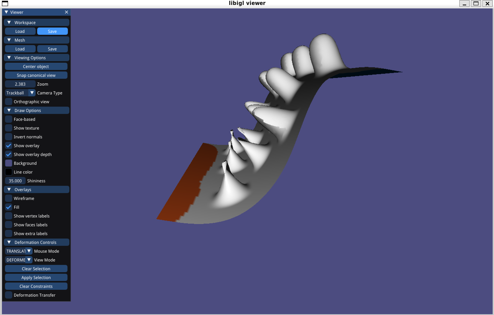 | 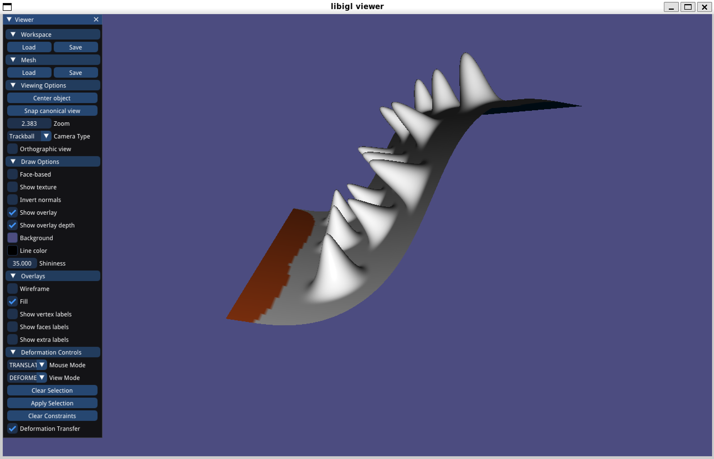 |
| cylinder | 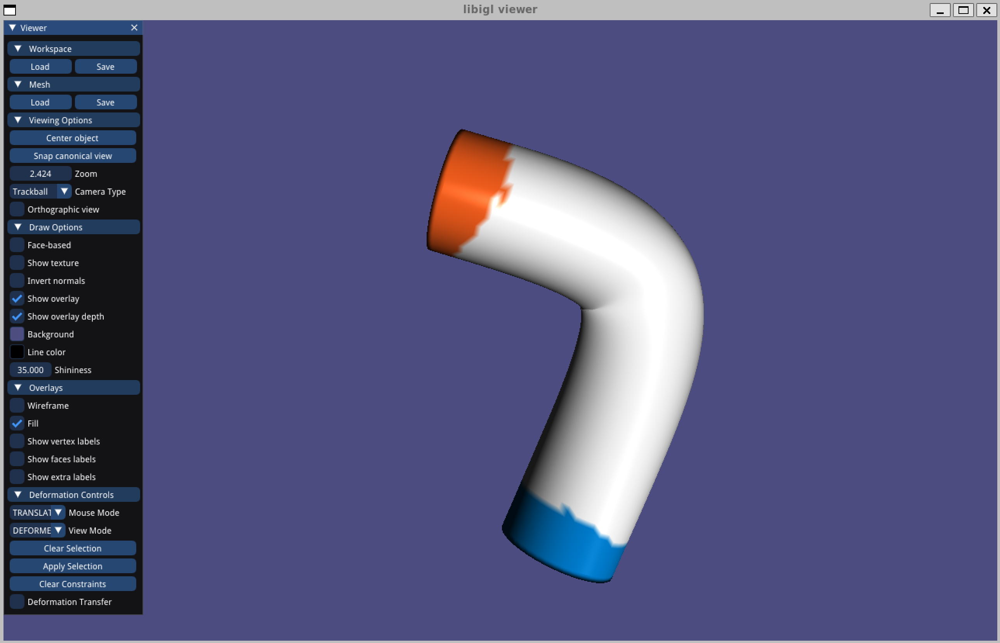 | 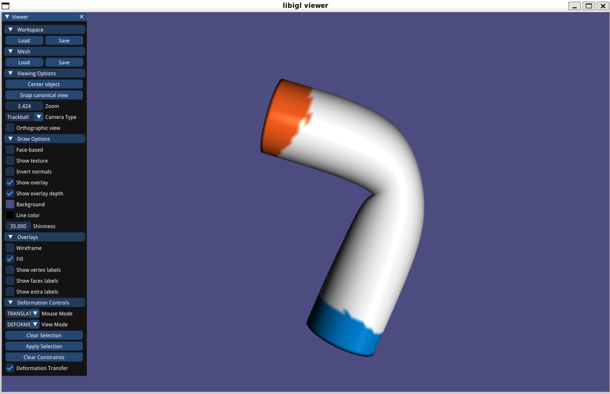 |
| bar | 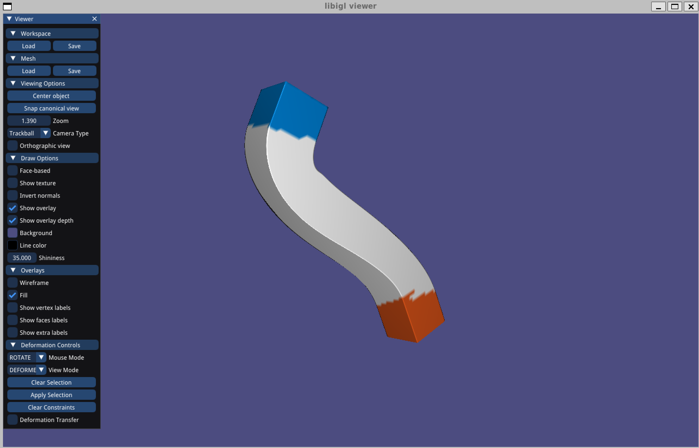 | 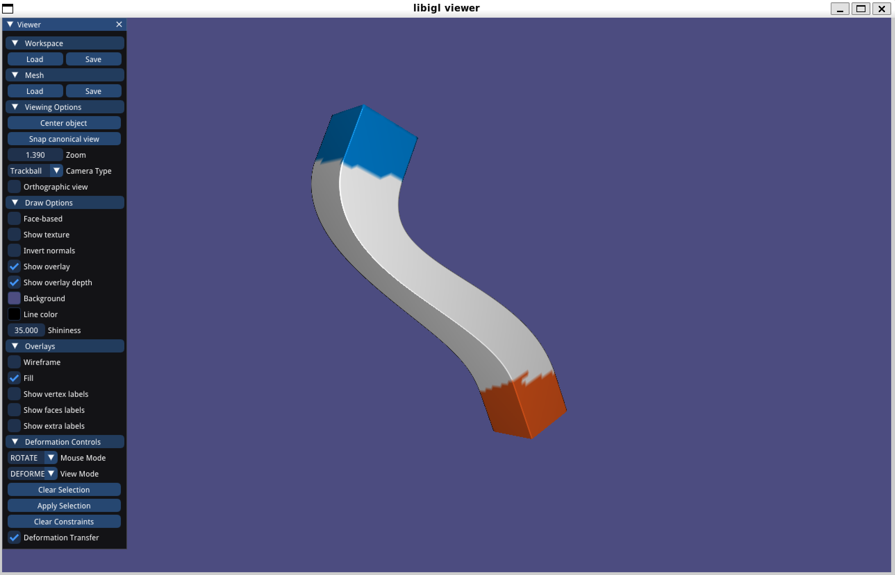 |
| cactus | 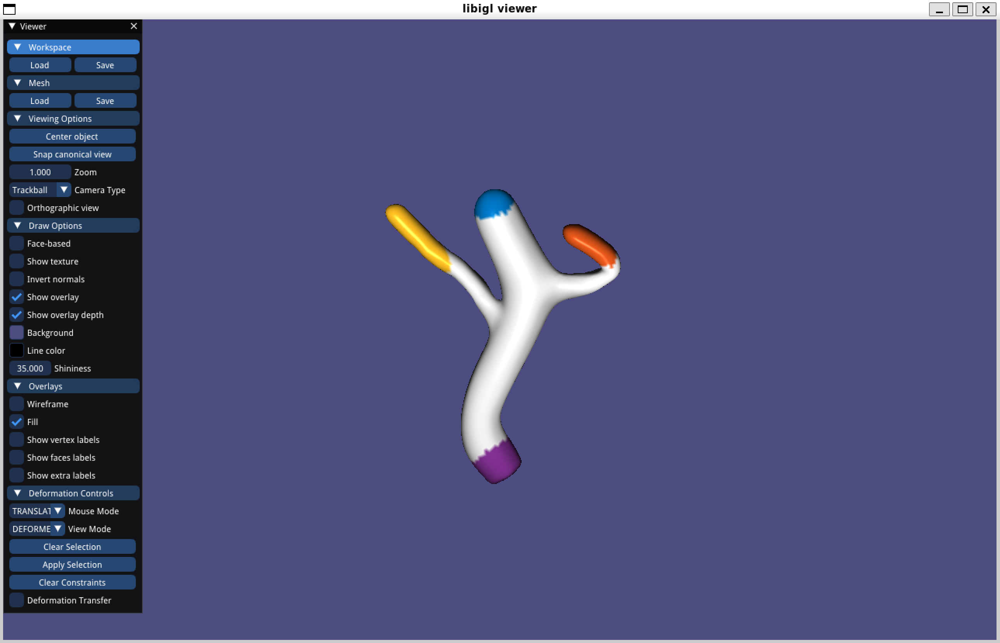 | 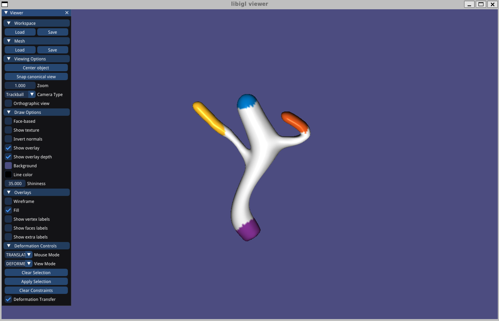 |
| camel_head | 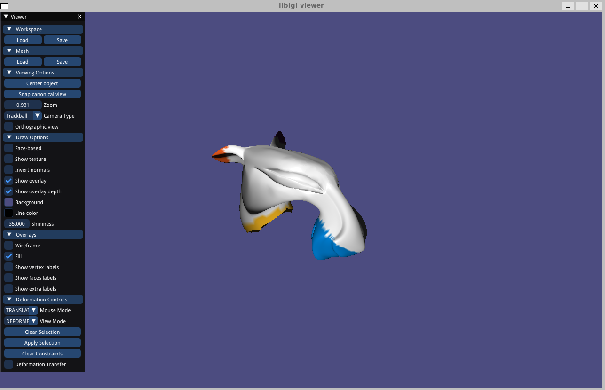 | 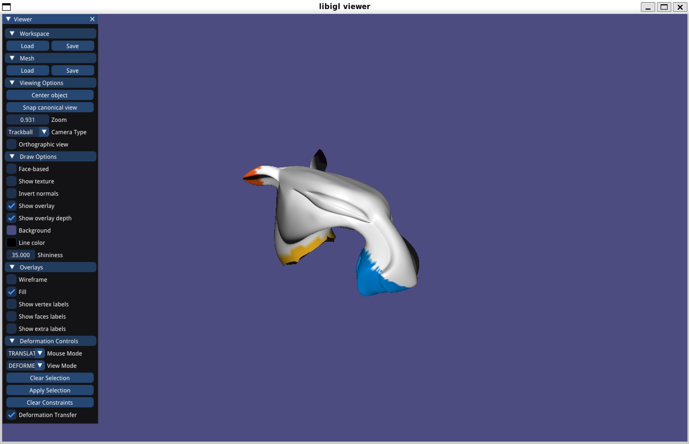 |
| hand | 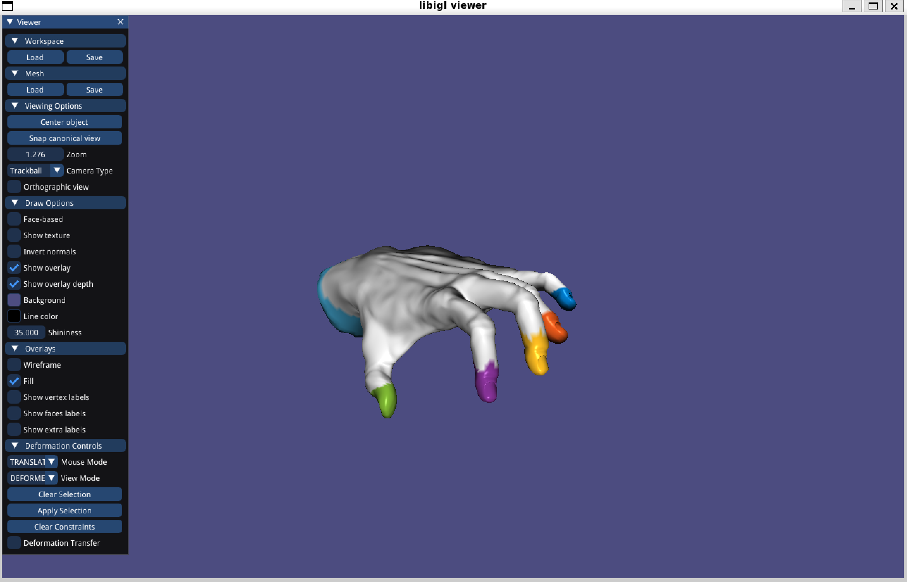 | 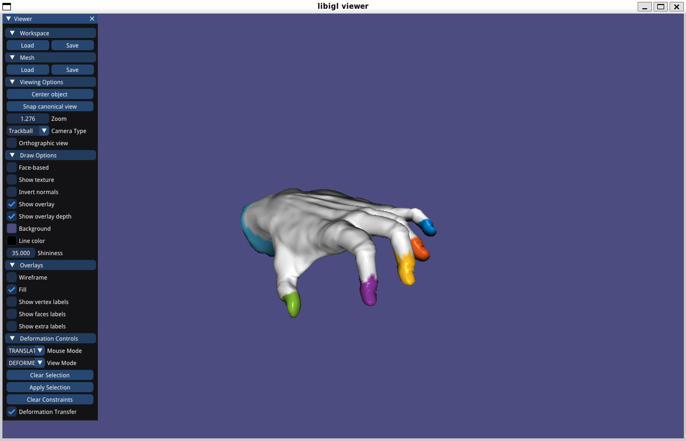 |
| woody-hi | 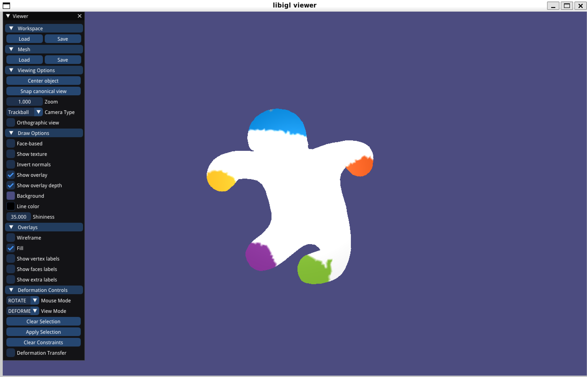 | 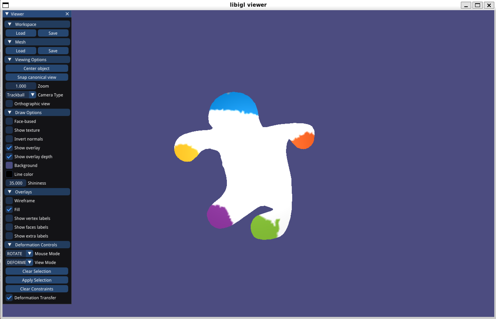 |
| woody-lo | 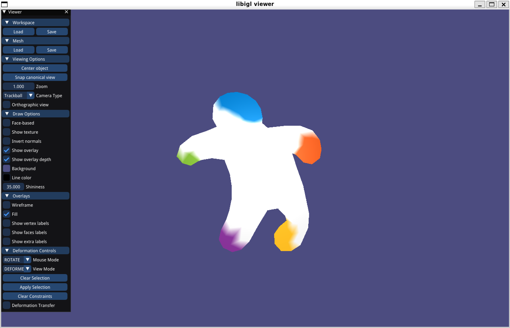 | 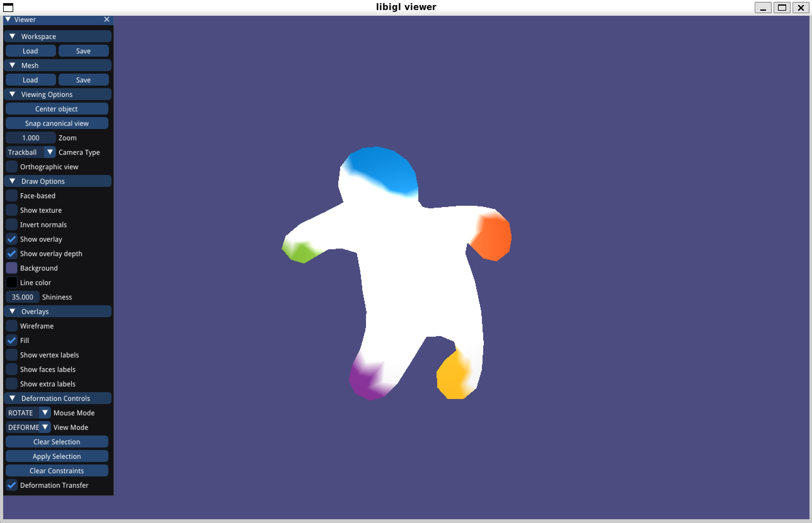 |
|  Differences  | main idea is to encode the high-frequency details into rotation invariant representation, then use naive-laplacian mesh editing and add the details back | equivalence to gradient-based deformations, main idea is to transfer the deformation between low-frequency mesh onto original mesh via solving Poisson system |
|  Advantages   | fast computation, just need to add a displacement for every vertices | able to handle mesh with a obvious height field              |
| Disadvantages | 1.not aware of the whole mesh, just add the coordinates separately leading to self-intersections of mesh 2.sometimes can't preserve details of mesh | higher computational complexity, need to compute the Sj and solve the Poisson system every time |
