# Assignment 6: Skinning & Skeletal Animation

Name: 'Sihan Chen'

Legi-Nr: '23-943-079'

## Required results
Edit this 'README.md' file to report all your results. Use the `./res` folder to store your results.

### Tasks

1. Read Sec. 1 carefully to get familiar with the data format, problem formulation, and mathematical background.
2. (Task 2) two theoretical discussions 
3. (Task 3) visualize the animation of the input skeleton of the hand shape from two types of input rotations (sequence and )
4. (Task 4) compute harmonic skinning weights on selected handles
5. (Task 5) per-vertex LBS + rotation/translation + Lerp
6. (Task 6) per-vertex LBS + dual quaternion + Nlerp
7. (Task 7) per-face LBS + averaging rotation + Poisson Stitching
8. (Task 8.1) context-aware per-vertex LBS
9. (optional Task 8.2) context-aware per-face LBS

### Important Note
1. We do not provide a template code for this assignment - feel free to use the previous template code if you want
2. You can use any functions in libigl, and its dependencies (and [libhedra](https://avaxman.github.io/libhedra/) if you want).
3. You are allowed to use your previous code (for example, you will find the Poisson Stitching technique quite similar to the Deformation Transfer that you have implemented in Assignment 5; and also the provided handle selection in A5 might inspire you to design your handle selection tool in Task 4).
4. You are allowed to modify this report freely (but please try to stick to some table format of orangizing figures to avoid a 20-page long report)
5. Please feel free to try other skeletal animation/deformation data you can find online if you find the provided animation is not cool enough (for example [here](https://www.mixamo.com/#/), but note that they might be in a different data format than the provided ones).
6. Please try to keep your code clean and self-explained (with necessary comments), since we will grade this assignment based on your code as well.

## Reports

### Task 2: Rotation Representation discussion
#### Task 2.1. compare different rotation representations

|  Representions  |                      Short Description                       |                             pros                             |                             cons                             |
| :-------------: | :----------------------------------------------------------: | :----------------------------------------------------------: | :----------------------------------------------------------: |
| rotation matrix |              3-by-3 matrix to describe rotation              |             transform vertex directly and easily             | 1.hard to interpolate 2.must restore 9 elements, high memory footprint |
|  euler angles   | 3 angle w.r.t. local axis to describe  with a specific orders of rotation |      1.lower memory footprint 2.transform vertex easily      |            1.gimbal lock 2.rotation order matters            |
|   axis angle    |         specify an axis and rotation angle around it         |         straightforward representation to understand         | 1. can't be used to transform vertex directly, need transform to other representation 2.numerical instability 3. hard to interpolate |
|   quaternions   | 4 elements to represent  a rotation (a scalar with length and a vector with rotation) | 1.no gimbal lock 2.good interpolation 3.efficient computation |                     not straightforward                      |

#### Task 2.2. Theoretical question for dual quaternions

|               Euler angles -> rotation  matrix               |                rotation matrix -> quaternion                 |         quaternion + translation -> dual quaternion          |
| :----------------------------------------------------------: | :----------------------------------------------------------: | :----------------------------------------------------------: |
| $R = R_z(\gamma)R_y(\beta)R_x(\alpha)$, where $ R_x(\alpha) = \begin{pmatrix} 1 & 0 & 0 \\ 0 & \cos \alpha & -\sin \alpha \\ 0 & \sin \alpha & \cos \alpha \end{pmatrix},  R_y(\beta) = \begin{pmatrix} \cos \beta & 0 & \sin \beta \\ 0 & 1 & 0 \\ -\sin \beta & 0 & \cos \beta \end{pmatrix}, R_z(\gamma) = \begin{pmatrix} \cos \gamma & -\sin \gamma & 0 \\ \sin \gamma & \cos \gamma & 0 \\ 0 & 0 & 1 \end{pmatrix}$ assuming X-Y-Z  rotation order | $R = \begin{pmatrix} r_{11} & r_{12} & r_{13} \\ r_{21} & r_{22} & r_{23} \\ r_{31} & r_{32} & r_{33} \end{pmatrix} $ $\text{tr}(R) = r_{11} + r_{22} + r_{33} $ $\text{tr}(R) > 0:  w = \frac{1}{2} \sqrt{1 + \text{tr}(R)}, x = \frac{r_{32} - r_{23}}{4w}, y = \frac{r_{13} - r_{31}}{4w},z = \frac{r_{21} - r_{12}}{4w}$ $\text{tr}(R) \leq 0:$ $ r_{11}$ is largest, $w = \frac{r_{32} - r_{23}}{4x},x = \frac{1}{2} \sqrt{1 + r_{11} - r_{22} - r_{33}}, y = \frac{r_{12} + r_{21}}{4x},  z = \frac{r_{13} + r_{31}}{4x}$  $ r_{22}$ is largest, $w = \frac{r_{13} - r_{31}}{4y}, x = \frac{r_{12} + r_{21}}{4y}, y = \frac{1}{2} \sqrt{1 - r_{11} + r_{22} - r_{33}}, z = \frac{r_{23} + r_{32}}{4y}$ $r_{33}$ is largest, $w = \frac{r_{21} - r_{12}}{4z}, x = \frac{r_{13} + r_{31}}{4z}, y = \frac{r_{23} + r_{32}}{4z}, z = \frac{1}{2} \sqrt{1 - r_{11} - r_{22} + r_{33}}$ | $q = q_0 + \frac{\epsilon}{2}(t_1\mathbf{i} + t_2\mathbf{j} + t_3\mathbf{k})$, where $q_0$ is a rotation represented as a quaternion, $t = (t_1, t_2, t_3)$ represents a translation |

### Task 3: animation of the skeleton
|                      rotaton sequence                      |               interpolation to target rotation               |
| :--------------------------------------------------------: | :----------------------------------------------------------: |
|  |  |

### Task 4: computing harmonic skinning weights on selected handles
#### Task 4.1. handle selection
| shape name           |  joint 1            |  joint 2            |  joint 3            |
| :------------------: |:------------------: |:------------------: |:------------------: |
| hand | 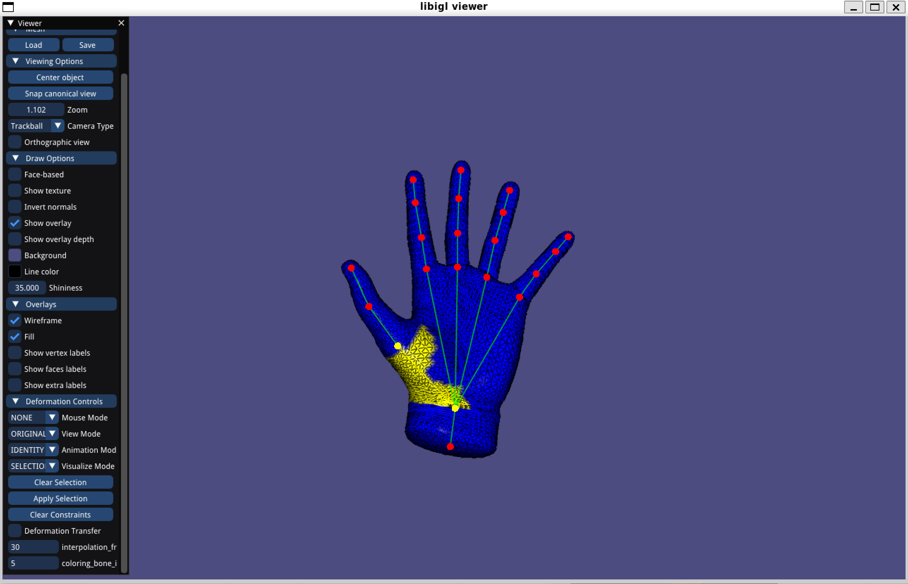 |  | 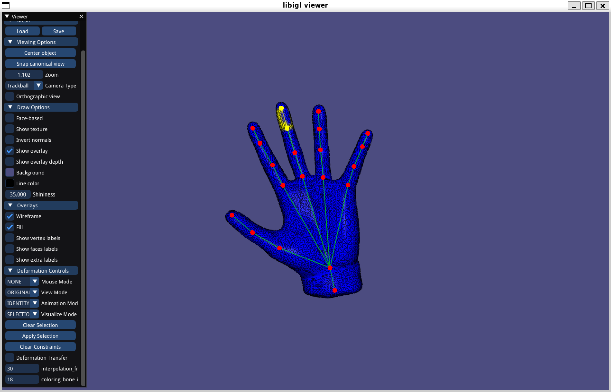 |

#### Task 4.2. skinning weights visualization
| shape name           |  joint 1            |  joint 2            |  joint 3            |
| :------------------: |:------------------: |:------------------: |:------------------: |
| hand | 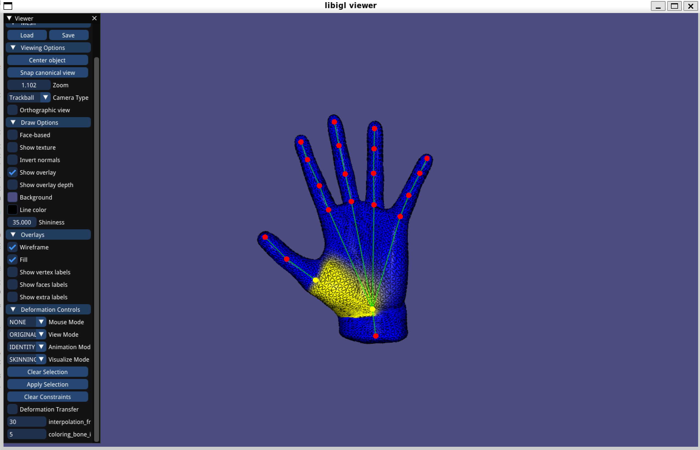 | 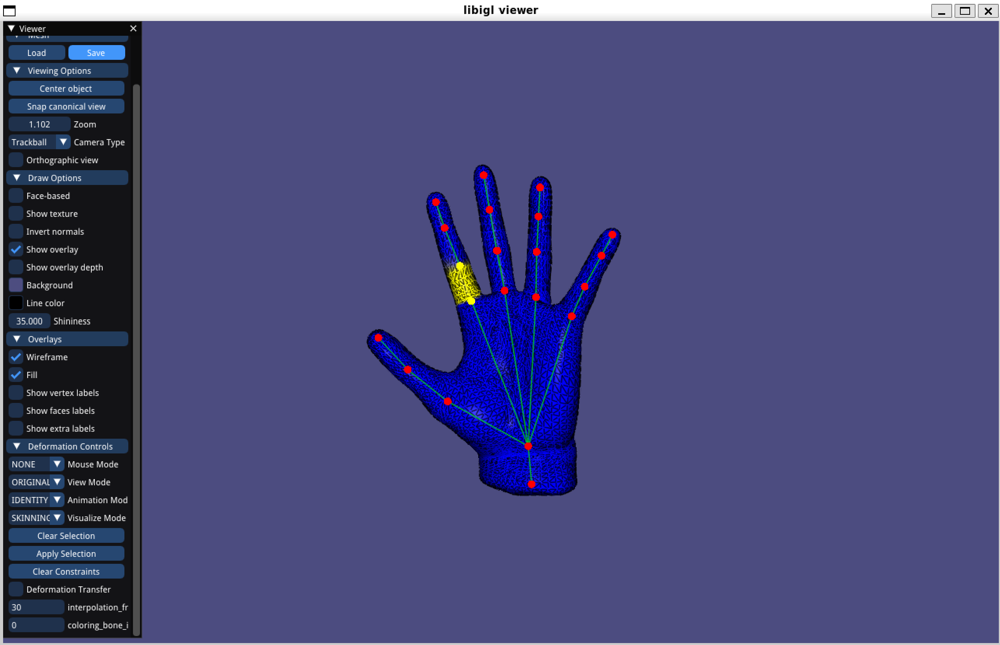 | 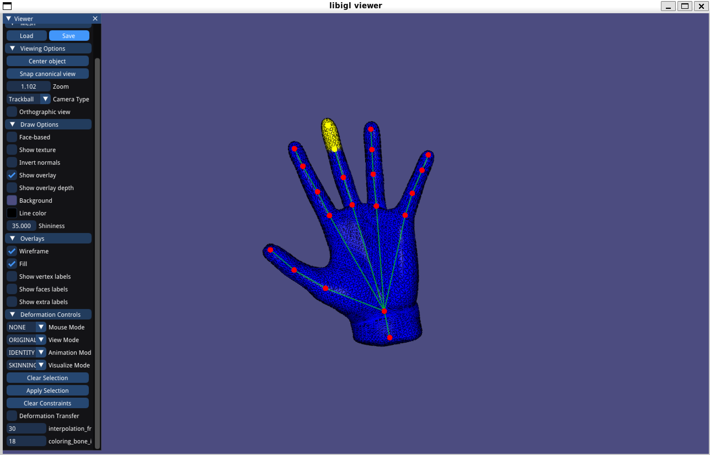 |

### Task 5/6/7: skeletal animation 
|             Task 5: Linear Blend Skinning             |           Task 6: Dual Quaternion Skinning            |       Task 7: per-face + averaging quaternions        |
| :---------------------------------------------------: | :---------------------------------------------------: | :---------------------------------------------------: |
|  |  |  |

Your comments (how these setups different from each other, and please compare the visual effects)

| Task 5: Linear Blend Skinning   | Task 6: Dual Quaternion Skinning      | Task 7: per-face + averaging quaternions  |
| :---------:                            |        :---------:                           |       :---------:                          |
| Vertex based, interpolation between transformed vertices |Vertex based, interpolation between quaternions(transformation), then used to transform vertex            |Face based, used to possion stitching to ensure the mesh not broken            |
| Comparatively good example |Comparatively good in this example |Forefinger has some artifact |

### Task 8.1: context-aware per-vertex LBS
#### Task 8.1.1 visualize the vertex_unposed example shapes
| shape name           |  pose 1             |   pose 2            |   pose 3            |
| :------------------: |:------------------: |:------------------: |:------------------: |
| human |  | 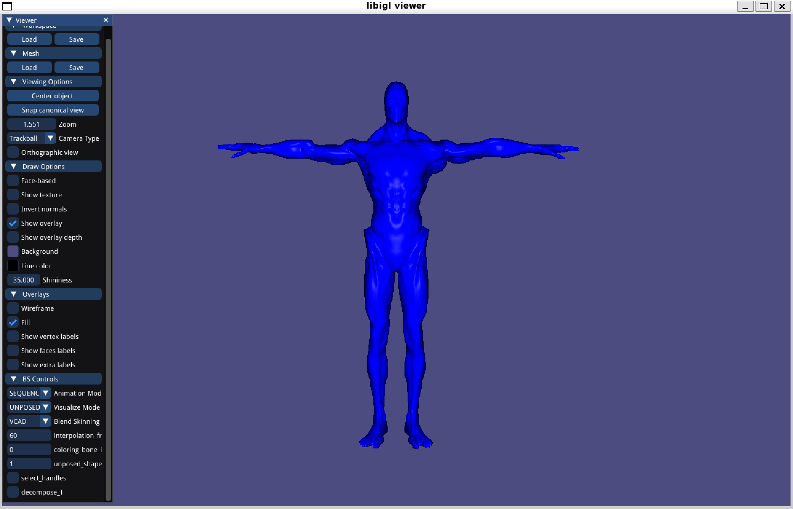 | 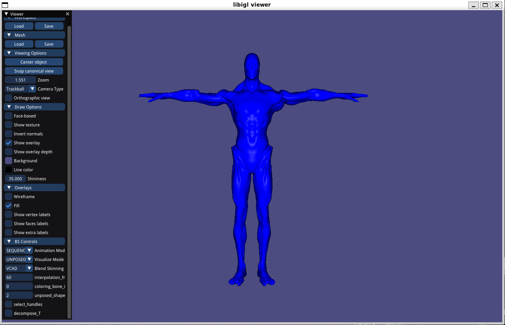 |

#### Task 8.1.2 skeletal animation using context
| without context   | with context     |
| :---------:                            |        :---------:                           |
|  |  |

### Task 8.2: context-aware per-face LBS

#### Task 8.2.1 visualize the face_unposed example shapes

| shape name           |  pose 1             |   pose 2            |   pose 3            |
| :------------------: |:------------------: |:------------------: |:------------------: |
| human | 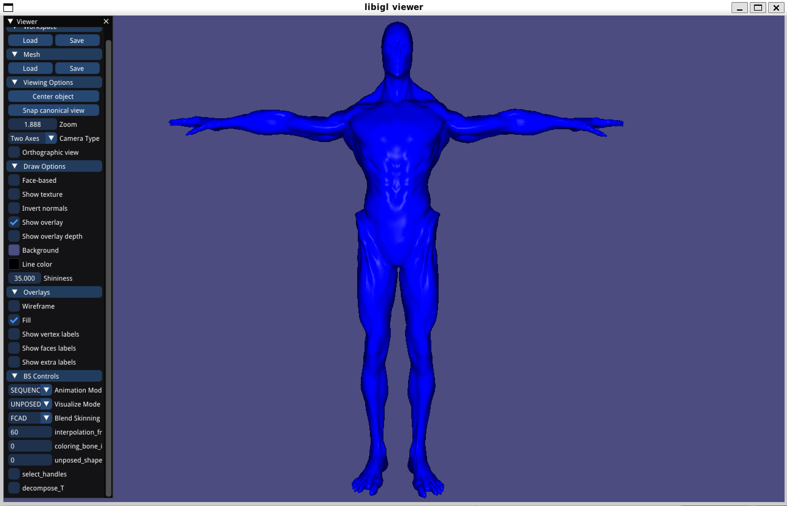 | 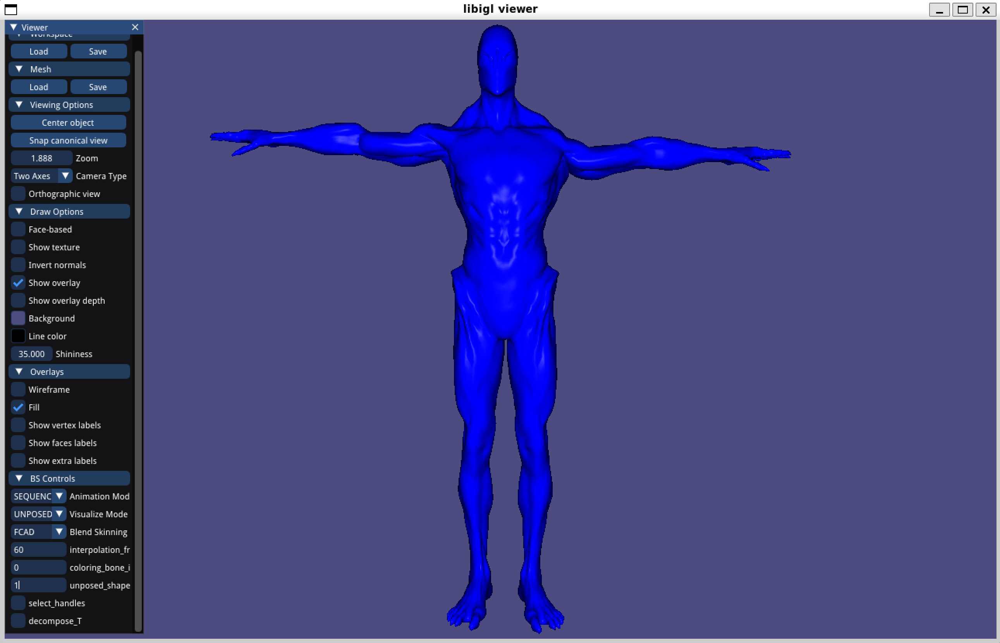 | 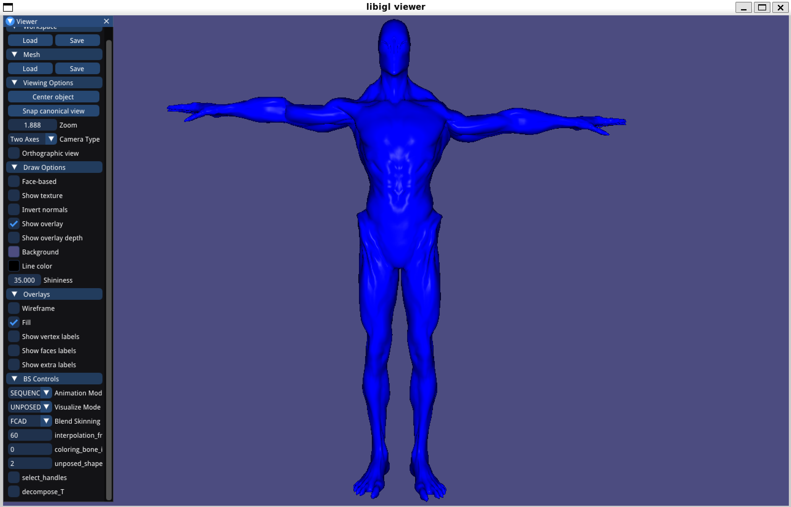 | 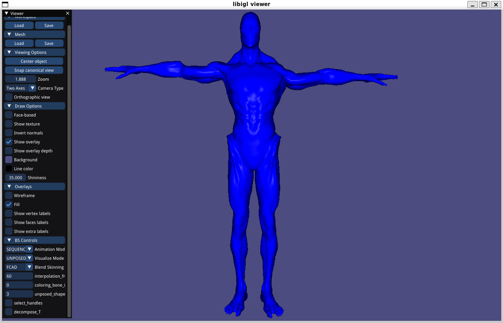 |

#### Task 8.2.2 skeletal animation using context
| without decomposition | with decomposition |
| :---------:                            |        :---------:                           |
|  |  |

| Vertex CAD | Face CAD |
| :---------:                            |        :---------:                           |
|  |  |