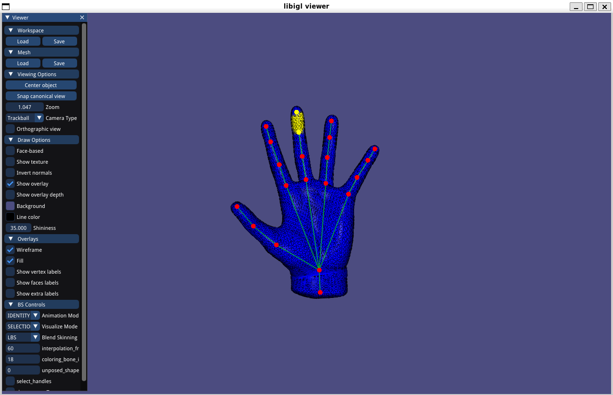
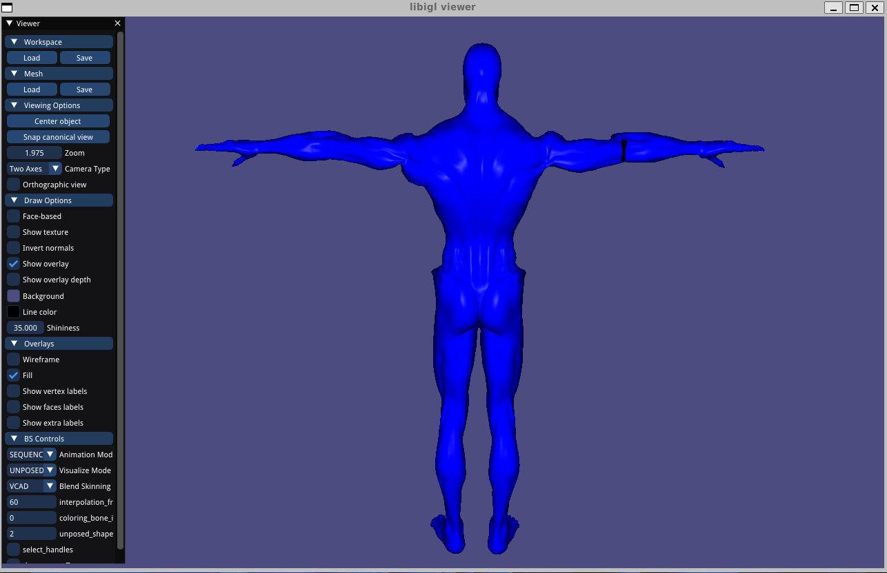

# Assignment 6: Skinning & Skeletal Animation

Name: 'Sihan Chen'

Legi-Nr: '23-943-079'

## Required results
Edit this 'README.md' file to report all your results. Use the `./res` folder to store your results.

### Tasks

1. Read Sec. 1 carefully to get familiar with the data format, problem formulation, and mathematical background.
2. (Task 2) two theoretical discussions 
3. (Task 3) visualize the animation of the input skeleton of the hand shape from two types of input rotations (sequence and interpolation)
4. (Task 4) compute harmonic skinning weights on selected handles
5. (Task 5) per-vertex LBS + rotation/translation + Lerp
6. (Task 6) per-vertex LBS + dual quaternion + Nlerp
7. (Task 7) per-face LBS + averaging rotation + Poisson Stitching
8. (Task 8.1) context-aware per-vertex LBS
9. (optional Task 8.2) context-aware per-face LBS

### Important Note
1. We do not provide a template code for this assignment - feel free to use the previous template code if you want
2. You can use any functions in libigl, and its dependencies (and [libhedra](https://avaxman.github.io/libhedra/) if you want).
3. You are allowed to use your previous code (for example, you will find the Poisson Stitching technique quite similar to the Deformation Transfer that you have implemented in Assignment 5; and also the provided handle selection in A5 might inspire you to design your handle selection tool in Task 4).
4. You are allowed to modify this report freely (but please try to stick to some table format of orangizing figures to avoid a 20-page long report)
5. Please feel free to try other skeletal animation/deformation data you can find online if you find the provided animation is not cool enough (for example [here](https://www.mixamo.com/#/), but note that they might be in a different data format than the provided ones).
6. Please try to keep your code clean and self-explained (with necessary comments), since we will grade this assignment based on your code as well.

## Reports

### Task 2: Rotation Representation discussion
#### Task 2.1. compare different rotation representations

|  Representions  |                      Short Description                       |                             pros                             |                             cons                             |
| :-------------: | :----------------------------------------------------------: | :----------------------------------------------------------: | :----------------------------------------------------------: |
| rotation matrix |              3-by-3 matrix to describe rotation              |        transform vertex directly and easy to compute         | 1.hard to interpolate 2.must restore 9 elements, high memory footprint |
|  euler angles   | 3 angles w.r.t. a coordinate system to describe  with a specific orders of rotation |      1.lower memory footprint 2.transform vertex easily      |            1.gimbal lock 2.rotation order matters            |
|   axis angle    |         specify an axis and rotation angle around it         |         straightforward representation to understand         | 1. can't be used to compute transformed vertex directly, need transform to other representation 2. hard to interpolate |
|   quaternions   | 4 elements to represent  a rotation (one for length and 3 elements for rotation) | 1.no gimbal lock 2.good interpolation 3.efficient computation | 1.not straightforward 2.two representation for the same rotation causing trouble |

#### Task 2.2. Theoretical question for dual quaternions

|               Euler angles -> rotation  matrix               |                rotation matrix -> quaternion                 |                                                              |         quaternion + translation -> dual quaternion          |
| :----------------------------------------------------------: | :----------------------------------------------------------: | ------------------------------------------------------------ | :----------------------------------------------------------: |
| $R = R_z(\gamma)R_y(\beta)R_x(\alpha)$, where $ R_x(\alpha) = \begin{pmatrix} 1 & 0 & 0 \\ 0 & \cos \alpha & -\sin \alpha \\ 0 & \sin \alpha & \cos \alpha \end{pmatrix} \\ R_y(\beta) = \begin{pmatrix} \cos \beta & 0 & \sin \beta \\ 0 & 1 & 0 \\ -\sin \beta & 0 & \cos \beta \end{pmatrix}\\ R_z(\gamma) = \begin{pmatrix} \cos \gamma & -\sin \gamma & 0 \\ \sin \gamma & \cos \gamma & 0 \\ 0 & 0 & 1 \end{pmatrix}$ assuming X-Y-Z  rotation order | $R = \begin{pmatrix} r_{11} & r_{12} & r_{13} \\ r_{21} & r_{22} & r_{23} \\ r_{31} & r_{32} & r_{33} \end{pmatrix} $ $t = \text{tr}(R) = r_{11} + r_{22} + r_{33} $$     if\ t > 0 :\\ r = \sqrt{1 + t} \\ s = \frac{1}{2r} \\ w = \frac{1}{2} r \\ x = (Q_{32} - Q_{23}) s \\ y = (Q_{13} - Q_{31}) s \\ z = (Q_{21} - Q_{12}) s $ | $if \ t < 0 \ $and $ Q_{11}$ is the largest diagonal entry (other situations follow the cyclic permutation):$\\r = \sqrt{1 + Q_{11} - Q_{22} - Q_{33}} \\ s = \frac{1}{2r} \\ w = (Q_{32} - Q_{23}) s \\ x = \frac{1}{2} r \\ y = (Q_{12} + Q_{21}) s \\ z = (Q_{31} + Q_{13}) s$ | $$q = q_0 + \frac{\epsilon}{2}(t_1\mathbf{i} + t_2\mathbf{j} + t_3\mathbf{k})$$, where $q_0$ is a rotation represented as a quaternion, $t = (t_1, t_2, t_3)$ represents a translation |

### Task 3: animation of the skeleton

|                      rotaton sequence                      |               interpolation to target rotation               |
| :--------------------------------------------------------: | :----------------------------------------------------------: |
|  |  |

### Task 4: computing harmonic skinning weights on selected handles
#### Task 4.1. handle selection
| shape name           |  joint 1            |  joint 2            |  joint 3            |
| :------------------: |:------------------: |:------------------: |:------------------: |
| geometry_selection |  |  |  |
| provided_solution |  |  |  |

#### Task 4.2. skinning weights visualization
| shape name           |  joint 1            |  joint 2            |  joint 3            |
| :------------------: |:------------------: |:------------------: |:------------------: |
| geometry_skinning_weight |  |  |  |
| provided_solution |  |  |  |

We can find the geometry selection is relatively accurate especially around the shape like thin cylinder(have similar radius), but if the radius change a lot like the joint1, it's not accurate like before.

### Task 5/6/7: skeletal animation 

| data     |                Task 5: Linear Blend Skinning                 |               Task 6: Dual Quaternion Skinning               |           Task 7: per-face + averaging quaternions           |
| -------- | :----------------------------------------------------------: | :----------------------------------------------------------: | :----------------------------------------------------------: |
| hand     |         |         |         |
| cylinder |  |  |  |

Your comments (how these setups different from each other, and please compare the visual effects)

|    | Task 5: Linear Blend Skinning   | Task 6: Dual Quaternion Skinning      | Task 7: per-face + averaging quaternions  |
| :---------:                            |        :---------:                           |       :---------:                          |       :---------:                          |
| setups | Vertex based, linear combination between transformed vertices/rotation and translation |Vertex based, interpolation between quaternions(transformation) using NLerp, the to transform vertex            |Face based, calculate the average rotation per face, and use them in poisson stitching to ensure the mesh not broken            |
| Visual effects | 1.Some meshes around joint sink into the palm causing sharp features  2.Skin is attached closely to skeleton 3."Elbow collapse" for the cylinder |1.Some meshes around joint sink into the palm causing sharp features   2.Skin is attached closely to skeleton  3. No "elbow collapse" for the cylinder |1. No sharp features around the palm 2.The skin is shifted off a little from the skeleton 3.Obvious self-intersections due to constraints |
| Analysis | 1.Vertices based methods, vertices are attached closely to skeleton, but sometimes there are sharp features 2.LBS used linear combination between rotation causing "elbow collapse" |1.Vertices based methods, vertices are attached closely to skeleton, but sometimes there are sharp features 2.DQS used NLerp to interpolate between rotation, solved "elbow collapse" problem |1.Poisson stitching solved Poisson equation based on faces (not on vertices) causing no sharp features(unlike previous vertex based methods), but also making the face far from the skeleton 2.Fixed root_bone causing obvious self-intersections |

### Task 8.1: context-aware per-vertex LBS

#### Task 8.1.1 visualize the vertex_unposed example shapes
| shape name           |  pose 1             |   pose 2            |   pose 3            |
| :------------------: |:------------------: |:------------------: |:------------------: |
| human_front |  |  |  |
| human_back |  |  |  |

There are some artifacts around the elbow of given example poses, which will influence the animation later.

#### Task 8.1.2 skeletal animation using context

| without context standard LBS | with context LBS |
| :---------:                            |        :---------:                           |
|  |  |
|1.No holes around the elbow, cause not using the given example poses with holes 2."Elbow collapse" still exists with not natural muscle shape, there are some self-intersections around the elbow. |1.Due to the artifacts of example pose, now the elbow animation have some holes 2.More natural muscle shape due to the given example, especially around the elbow joint, less self-intersections around the elbow. |

### Task 8.2: context-aware per-face LBS

#### Task 8.2.1 visualize the face_unposed example shapes

| shape name           |  pose 1             |   pose 2            |   pose 3            |   pose 4   |
| :------------------: |:------------------: |:------------------: |:------------------: |-------------------- |
| human_font |  |  |  |  |
| human_back |  |  |  |  |

We can see there are still holes around the elbow in given example poses.

#### Task 8.2.2 skeletal animation using context

| without decomposition | with decomposition | details |
| :---------:                            |        :---------:                           |        -----------                           |
|  |  |  |
|1.Directly linear average on $T_{jf}$, including the rotation part, this will make the post-fix rotation less exact, e.g., there are self-intersections between left arm and body 2.No need to solve eigenvectors for every frame, higher efficiency, thus higher fps |1.Considered the rotation part in $T_{jf}$, average the rotation part (eigenvectors with biggest eigenvalues) and skew part(linear average) respectively, this will make the post-fix rotation more exact, e.g., there are no self-intersections between left arm and body 2.Need to solve eigenvectors every frame for each face, obviously lower fps |When changing from two methods, we can find the left arm self-intersections with body is obvious |

| Vertex-based Context Aware Deformation | Face-based Context Aware Deformation |
| :---------:                            |        :---------:                           |
|  |  |
|1.Due to holes in the given example poses, there's hole around elbow in animation 2.Vertex-based deformation, using given example poses to calculate displacement in reset pose(use matrix inverse to map to reset space), then interpolate between different given example poses w.r.t. pose parameters to get displacements in pose space, then add them back 3.Due to vertex based(interpolation between vertices), the mesh is not too far away from skeleton 4.Just need to add the interpolated displacement back in pose space, higher efficiency |1.Due to poisson stitching, there's no hole around elbow in animation although there's in given example poses 2.Face-based deformation, use poisson stitching map the given example poses back to the reset space from pose space, further calculate the rotation from reset space to pose space of each examples, then interpolate between different given example poses w.r.t pose parameters to get rotation 'displacements' for each face from rest space to pose space, then use poisson stitching again to get the final vertices. 3.Due to face based (poisson-stitching), sometimes the mesh moves far away from skeleton 4.Need to solve poisson equation lower efficiency |

